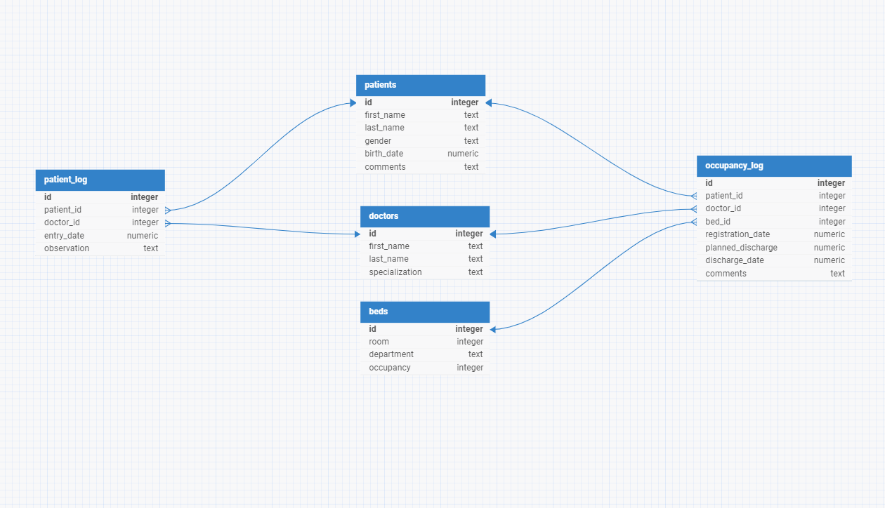

# Design Document

By Mateusz Gimziński

Video overview: https://youtu.be/IzbGiEdzmcA

## Scope

The database of the fictitious Warsaw hospital aims to digitize and organize patient data from the moment of registration to discharge, as well as the necessary data for the hospital's permanent medical staff. The primary goal of maintaining the database is to streamline hospital operations and improve the quality of medical services provided to its patients. As such, included in the database's scope is:

* Patients, including basic identifying information of a patient,
* Doctors, including basic identifying information along with medical specialization of a doctor,
* Beds, including information on free and taken beds in the hospital.
* Occupancy log, including planning registrations and discharges for the medical staff planing hospital occupancy.
* Patient's log, including all of the current observations and guidelines regarding each patient.

Out of scope are elements like: occupancy of hospital equipment, discharge information for the illness history.

## Functional Requirements

* CRUD operations for doctors and medical staff
* Tracking information on each patietnt during their stay in hospital
* Gathering neccessary data for medical staff on their patients in one place

This database won't allow patients to give opinions on their stay.

## Representation

Entities are captured in SQLite tables with the following schema:

### Entities

The database includes the following entities:

#### Patients

The `patients` table includes:

* `id`, which specifies unique ID for the patient as an `INTEGER`. This column is also the `PRIMARY KEY` for this table with applicable constraint applied.
* `first_name`, which specifies patient's first name as `TEXT`.
* `last_name`, which specifies patient's last name as `TEXT`.
* `gender`, which specifies patient's gender as `TEXT` with a constraint `CHECK` allowing
only 'Male', 'Female' and 'Other' values.
* `birth_date`, which specifies patient's birth day as `NUMERIC`.
* `comments`, which specifies additional information on patient as `TEXT`.

All of the columns in `patients` table should have `NOT NULL` constraint applied but it is not done as hospital can also register emergency patients whose identity might be unkonwn for the time of registration.

#### Doctors

The `doctors` table includes:

* `id`, which specifies unique ID for the doctor as an `INTEGER`. This column is also the `PRIMARY KEY` for this table with applicable constraint applied.
* `first_name`, which specifies doctor's first name as `TEXT`.
* `last_name`, which specifies doctor's last name as `TEXT`.last_
* `specialization`, which specifies doctor's specialization as `TEXT`.

All of the column's in the `doctors` table are required therefore `NOT NULL` constraint is applied.

#### Beds

* `id` which specifies unique ID for each bed as an `INTEGER`. This column is also the `PRIMARY KEY` for this table with applicable constraint applied.
* `room` which specifies room number where the bed is located as an `INTEGER`.
* `department` which specifies in which department the bed is located `TEXT`.
* `occupancy` which specifies if the bed is free or taken as `INTEGER` (0 or 1 values only, based on the dates in `occupancy_log` table - applicable TRIGGERs written in schema.sql), default value - 0.

All of the column's in the `beds` table are required therefore `NOT NULL` constraint is applied.

#### Occupancy log

* `id` which specifies unique ID for the log entry as `INTEGER`. This column is also the `PRIMARY KEY` for this table with applicable constraint applied.
* `patient_id` which specifies ID of the patient occuping a bed as `INTEGER`. This column is a foreign key reffering to the column `id` from table `patients`.
* `doctor_id` which specifies ID of the patients leading doctor as `INTEGER`. This column is a foreign key reffering to the column `id` from table `doctors`.
* `bed_id` which specifies ID of the occupied bed as `INTEGER`. This column is a foreign key reffering the column `id` in table` from table `beds`.
* `registration_date` which specifies the date when patient will be registered to the hospital as `NUMERIC`.
* `discharge_date` which specifies the final discharge date as `NUMERIC`.
* `comments` which specifies additional comments from the medical staff as `TEXT`.

#### Patients log

* `id` which specifies unique ID for the log entry as `INTEGER`. This column is also the `PRIMARY KEY` for this table with applicable constraint applied.
* `patient_id` which specifies ID of the patient. This column is a foreign key reffering to the column `id` from table `patients`.
* `doctor_id` which specifies ID of the doctor leading the patient. This column is a foreign key reffering to the column `id` from table `doctors`.
* `entry_date` which specifies the date when entry was done as `NUMERIC`, default value is the current timestamp.
* `observations` which specifies list of observations made by the doctor regarding treated patient as `TEXT`.

All of the column's in the `patients_log` table are required therefore `NOT NULL` constraint is applied.

### Relationships

The below entity relationship diagram describes the relationships among the entities in the database.

* One patient can be treated one to many times, record of treatments is tracked in the patients log. A single treatment in the patient log is related only to one patient. The same patient can have only one leading doctor. At the same time one doctor can be a leading doctor of many patients.

* One bed can be occupied 0 to many times, record of occupancies is tracked in occupancy log. One bed can be occupied by only one patient at the time. One patient can occupy one to many beds.

## Optimizations

* Insert, update, delate occupancy triggers - to allow database user checking chosen bed occupancy status in real time.
* Check duplicate occupancy trigger - to disallow database user inserting into the occupancy log entries for chosen bed which is overlapping the dates of any existing reservation.
* Current patients view - to allow database user checking all of the necessary information on patients who are currently treated in the hospital.
* To be discharged view - to allow database user checking all of the necessary information on patients who are going to be discharged given day.
* To be registered view - to allow database user checking all of the necessary information on patients who are going to be registered given day.
* Beds occupancy index - to minimize database use when quering beds status.
* Registrations index - to minimize database use when using to_be_registered view.
* Discharges index - to minimize database use when using to_be_discharged view.
* Doctors patients index - to minimize database use when quering for all of the patients who are
currently led by chosen doctor.
* Patients history index - to minimize database use when quering for the chosen patient treatment history.

## Limitations

* The current schema does not allow many doctors to lead the same patient.
